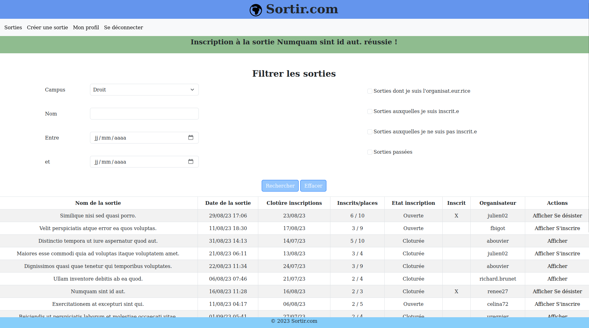

<h3>ENI Sorties – Projet Symfony </h3>

_Projet en équipe, avec PHP, Symfony, vanilla JS, Bootstrap & MySQL_

    

Pour lancer l'appli...

1. il vous faudra PHP 8.2
2. composer install
3. npm install
4. Créer une base de données nommée 'sortir'
5. Duplier le .env en un .env.local et renseigner les infos de la BDD

Puis set-up la BDD & la remplir avec les fixtures 

6. php bin/console doctrine:migrations:migrate 'DoctrineMigrations\Version20230207092652'
7. php bin/console doctrine:migrations:migrate 'DoctrineMigrations\Version20230208093723'
8. php bin/console doctrine:fixtures:load

Et enfin lancer :

9. symfony server:start
10. Pour se connecter, prendre n'importe quel pseudo présent dans la table 'participant' & le mdp sera 'test' :)